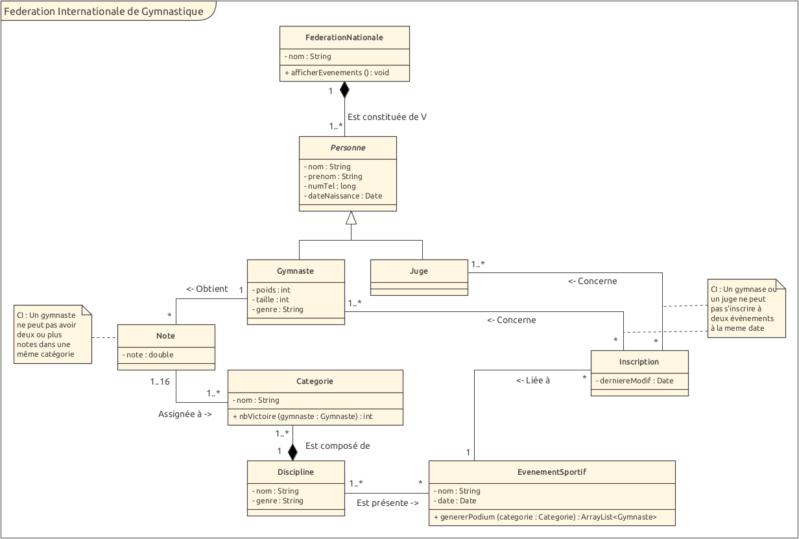

# Rapport Labo02
Edwin Häffner, Arthur Junod 

## Introduction

Le but de ce laboratoire est de se familiariser avec les schémas UML. Nous avons donc modélisé une 
structure de Fédération Nationale de Gymnastique en suivant des instructions. 

## Explication des choix dans le schéma UML

La catégorie n'est pas directement liée au gymnaste, nous avons fait une classe note qui associe les deux
pour pouvoir faire un lien entre la note du gymnaste et une catégorie.

En suivant les instructions données par la consigne du laboratoire, nous en avons déduit que pour chaque inscription il
y a au moins 1 juge et 1 gymnaste qui sont envoyés par la fédération (d'où les deux cardinalités 1..*).

Nous avons décidé de retourner une liste de gymnaste pour la fonction `genererPodium(Categorie categorie)` 
afin de récupérer facilement les 3 gymnastes faisant partie du podium. Ils seront classé dans l'ordre
suivant: (1er) indice 0, (2ème) indice 1, (3ème) indice 2.

