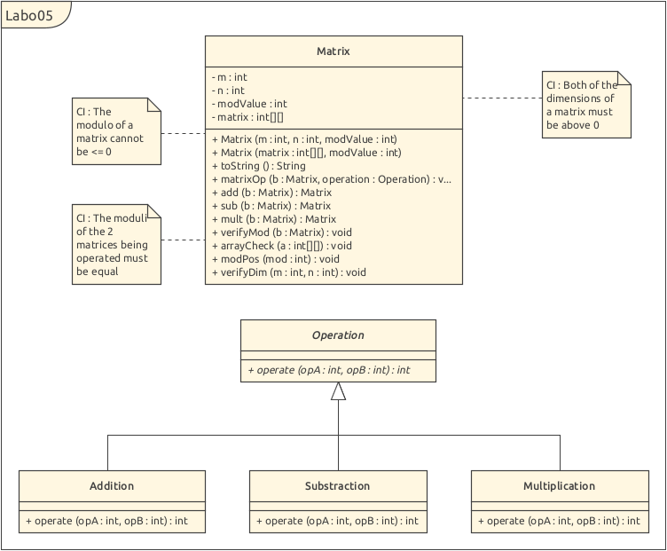

# Laboratoire 5 : Matrices

Auteurs: Arthur Junod, Edwin Haeffner

## Introduction

Le but de ce laboratoire est d'implémenter une classe ```Matrix```
qui nous permettera de faire différentes opérations sur des matrices. La classe permet aussi d'afficher la matrice déclarée dans l'objet `Matrix` dans le terminal.

## Choix d'implémentation



<p align="center">
<i>Schéma UML du programme</i>
</p>

Comme indiqué par les consignes du laboratoire, il faut rendre possible et facile l'ajout de nouvelles opérations. 
Nous avons donc fait une classe abstraite qui nous permet d'appliquer une opération donnée sur 2 opérandes.
Addition va effectuer A + B, Subtraction va effectuer A - B, et ainsi de suite...<br>

Dans ```Matrix``` nous avons une méthode : ```matrixOp()```, qui est le cœur de notre programme. Cette fonction va prendre
un à un les éléments des deux matrices et les opérer ensemble selon le type d'opération donnée (on utilise la classe abstraite ```Operation``` pour
manipuler les opérandes). *Si une matrice est plus petite que l'autre en largeur comme en longueur, on opère avec des 0.* <br>

Finalement, nous avons des méthodes qui vont faire appel à ```matrixOp()``` et qui vont mettre à disposition une méthode pour
chaque sous-classe de ```Operation``` (par exemple la méthode ```sub()``` qui fera appel à ```matrixOp(b, new Subtraction())```).<br>

Ces méthodes spécifiques à chaque sous-classe permettent une utilisation plus simple pour les utilisateurs futurs. Le désavantage
étant que pour ajouter une nouvelle opération, nous devrons faire une étape en plus et créer une méthode spécifique à cette nouvelle
opération.

Donc pour rajouter une opération, il faudra :

1. Créer une nouvelle sous-classe de la classe abstraite ```Operation```.
2. Override la méthode ```operate()``` qui sera celle appelée par ```Matrix``` (elle s'exécute sur 2 opérandes int).
3. Faire une nouvelle méthode membre de Matrix qui appellera notre nouvelle classe dans ```matrixOp()```.

<div style="page-break-after: always"></div>

## Tests effectués

Tous les tests du fichier **MatrixTest** ont été éffectués grâce à JUNIT.

| Nom test                    | Description                                                                                                      | Résultats |
| --------------------------- | ---------------------------------------------------------------------------------------------------------------- | --------- |
| ```testAdd()```             | Compare un résultat codé en dur au résultat de notre fonction ```add()```                                        | PASS      |
| ```testSub()```             | Compare un résultat codé en dur au résultat de notre fonction ```sub()```                                        | PASS      |
| ```testMult()```            | Compare un résultat codé en dur au résultat de notre fonction ```mult()```                                       | PASS      |
| ```testMod()```             | Vérifie que le modulo ne laisse pas passer de valeurs négatives                                                  | PASS      |
| ```testMatrixNotFull()```   | Vérifie que l'on peut construire une Matrix depuis un tableau 2d qui n'est pas rectangulaire                     | PASS      |
| ```testInitDimMod()```      | Vérifie que nous ne pouvons pas construire une Matrix par dimension en donnant un modulo négatif ou égal à 0     | PASS      |
| ```testInitMatrixMod()```   | Vérifie que nous ne pouvons pas construire une Matrix par tableau en donnant un modulo négatif ou égal à 0       | PASS      |
| ```testVerifyMod()```       | Vérifie que nous ne pouvons pas appliquer une opération (ici addition) sur 2 Matrix qui n'ont pas le même modulo | PASS      |
| ```testInitDimZero()```     | Vérifie que nous ne pouvons pas construire une Matrix en donnant des dimensions négatives ou égales à 0          | PASS      |
| ```testInitEmptyMatrix()``` | Vérifie que nous ne pouvons pas construire une Matrix à partir d'un tableau vide                                 | PASS      |

```testInitDimMod()```, ```testInitMatrixMod()```, ```testVerifyMod()```, ```testInitDimZero()```, ```testInitEmptyMatrix()``` vont vérifier que les bonnes
exceptions sont levées.

```testAdd()```, ```testSub()```, ```testMult()```, ```testMod()```, ```testMatrixNotFull()``` font des comparaisons entre des résultats de fonctions et
des résultats attendus codés en dur.

Nous avons également testé l'initialisation aléatoire dans le ```main()``` de façon visuelle (```System.out.println()```) car nous ne savions pas comment 
l'implémenter dans JUNIT.

<div style="page-break-after: always"></div>

## Execution main()

```
The modulus is 5
one
1 3 1 1 
3 2 4 2 
1 0 1 0

two
1 4 2 3 2 
0 1 0 4 2 
0 0 2 0 2

one + two
2 2 3 4 2 
3 3 4 1 2 
1 0 3 0 2

one - two
0 4 4 3 3 
3 1 4 3 3 
1 0 4 0 3

one x two
1 2 2 3 0 
0 2 0 3 0 
0 0 2 0 0

Test randomness: 
0 5 6 2 
3 1 2 4 
2 0 3 6 
3 2 0 0

1 2 1 1 
2 2 2 3 
1 4 0 6 
0 5 0 5

1 1 6 2 
6 3 1 2 
6 2 2 4 
0 3 6 5

Process finished with exit code 0
```