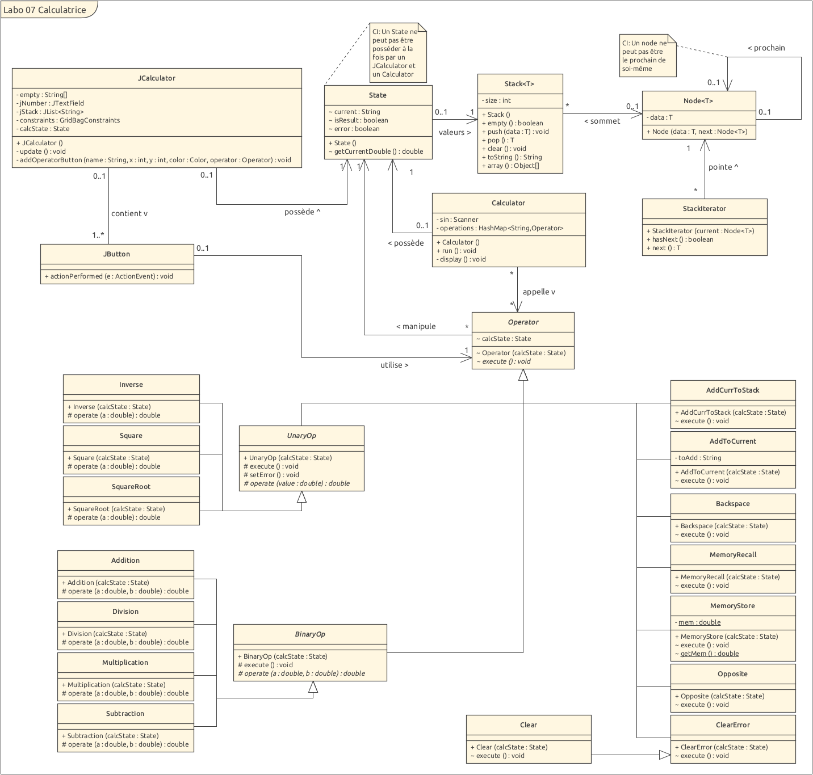

# Laboratoire 7: Calculatrice

Edwin Häeffner, Arthur Junod

## Introduction

Pendant ce labo, nous devions être capables d'implémenter une calculatrice graphique (partie implémentation graphique donnée) et 
par terminal. Le but était d'utiliser au maximum la classe abstraite ```Operator``` qui nous était donnée afin de factoriser le 
code le plus possible.

## Choix d'implémentation



Nous avons omis de discuter des implémentations que nous ne pensions pas assez intéressantes.

### State

Pour représenter l'état courant de la calculatrice, nous avons implémenté la classe State avec les attributs suivants :

- Une pile (stack) permettant de stocker les opérandes des calculs binaires.

- Une chaîne de caractères (String) servant à construire progressivement un nombre qui sera ensuite utilisé pour les calculs unaires et binaires.

- Deux flags sous forme de booléens :
  
  - error : indiquant si une erreur s'est produite lors d'une opération.
  
  - isResult : précisant si l'élément courant dans le String provient du résultat d'une opération unaire ou binaire.

La pile stocke les opérandes entre chaque calcul binaire, tandis que le String est le nombre actuellement manipulé ou bien le résultat d'une opération.

Les flags error et isResult servent respectivement à contrôler l'exécution correcte des opérations et à déterminer si le résultat courant doit être mis dans la pile ou non.

L'objet State centralise ainsi l'ensemble des données représentant l'état global de la calculatrice.

La méthode getDoubleCurrent() permet d'accéder au résultat en `double` (au lieu de String) et peut lever une exception. 
Mais cela n'arrive pas dans le cadre de ce programme donc on essaie pas de la gérer.

### Operator, BinaryOp et UnaryOp

Nous avons décidé de créer deux classes abstraites en plus de ```Operator``` afin de 
rendre plus simple la vérification des opérandes 
lors des appels à des opérations unaires ou binaires.

Il était aussi plus simple de vérifier que le flag d'erreur de ```State``` ne soit pas true dans ces deux
classes.

Dans ```UnaryOp```, on va vérifier l'état du flag d'erreur et de current.

Dans ```BinaryOp```, on va vérifier également l'état du flag d'erreur et de current mais aussi celui de la
stack.

<div style="page-break-after: always"></div>

### Package calculator.binaryop

C'est dans ce package que se trouve toutes les opérations binaires (Addition, Soustraction, Division et Multiplication).

Elles vont également implémenter la fonction `operate()` qui sera utilisée dans le `execute()` de 
```BinaryOp```. Par exemple, le operate de Addition fera `a + b`.

### Package calculator.unaryop

C'est dans ce package que se trouvent presque toutes les opérations unaires (Inverse, Racine carrée et Puissance de 2).

De facon pair au package binaryop, elles implémentent la même fonction `operate()` qui sera utilisée dans `execute()` de
```UnaryOp```.

### Autre operations:

Dans la plupart des opérations qui change le String *current* ou la stack, si le flag error est a `true`, ces opérations
ne se feront pas du tout. Il faudra alors lever l'erreur avec `Clear` ou `MemoryClear`.

#### AddToCurrent

Nous avons décidé de créer cette opération afin de mettre les boutons nombres et le bouton point à la même enseigne.
Elle permet de construire progressivement la chaîne de caractères représentant le nombre affiché (current), en y ajoutant les caractères saisis par l'utilisateur.

Cette opération se charge également de placer la chaîne current dans la pile lorsqu'elle constitue un résultat calculé.

Elle vérifie en outre que la chaîne en construction a bien une syntaxe valide de nombre décimal,
en empêchant des concaténations non conformes telles que "0.23.45" ou "0024".
Cela évite de potentielles exceptions lors de la conversion de la chaîne en `double` par la 
méthode `parsingDouble()` de l'objet `State`.

#### Backspace

Cette opération nous permet d'effacer le dernier caractère du String *current* ou de le mettre à "0" suivant
sa taille.

On y vérifie aussi que l'on ne puisse pas éventuellement enlever des caractères au message d'erreur et aux
valeurs Double "NaN" et "Infinity".

Cela garantit qu'une fois de plus, nous n'ayons aucun problème au niveau du `parsingDouble()` du ```State```.

<div style="page-break-after: always"></div>

#### MemoryStore

Nous avons rajouté un attribut static *mem* à cet objet afin que ce soit la classe elle-même qui stocke la
valeur.

Nous ne trouvions pas forcément logique que le ```State``` ait un attribut en plus juste pour cette opération
et nous l'avons donc mis ici.

Il a également un getter, car l'attribut est ici privé.

#### Opposite

Nous vérifions seulement qu'il ne soit pas possible de changer le signe de "0", "NaN" ou "Infinity".

Cette classe n'a pas été rajoutée dans les opérations unaires, car en testant la calculatrice, nous nous
sommes apercu que si nous devions prendre le signe opposé d'un Double, il rajouterait une décimale à notre
*current*. Et comme passer par ```UnaryOp``` signifie forcément utiliser la fonction `operate()` et donc un
Double, nous devions la séparer du reste des opérations unaires.

### Calculator

Pour la version terminale de la calculatrice, nous avons utilisé une HashMap pour toutes les opérations sauf
celle de ```AddToCurrent```.

Le problème de ```AddToCurrent``` était qu'elle était pensée pour être utilisée char par char, ce qui n'est pas
le cas d'une entrée utilisateur. Nous avons donc vérifié d'abord si l'entrée utilisateur faisait partie des opérations
de la HashMap et ensuite vérifier que l'entrée soit valide avant d'enfin rajouter toute l'entrée d'un coup à current en
utilisant ```AddToCurrent```. Il faut ensuite mettre le flag *isResult* à true car la prochaine entrée utilisateur
devra push le *current* sur la stack.

Cette implémentation nous permet donc d'utiliser les mêmes opérations que dans la calculatrice graphique.

<div style="page-break-after: always"></div>

## Test

La plupart des tests nous ont permis de rajouter des vérifications sur l'intégrité des données que nous utilisions dans nos
opérations.

### StackTest

| Nom               | Description                                                                       | Résultat |
| ----------------- | --------------------------------------------------------------------------------- | -------- |
| testEmptyStack    | Teste si la fonction `empty()` renvoie bien true quand la pile est vide           | PASS     |
| testPushAndPop    | Teste les fonctions `push()` and `pop()` de la pile                               | PASS     |
| testPopEmptyStack | Vérifie que l'on lance une exception quand on essaye de pop une pile vide         | PASS     |
| testToString      | Vérifie que la fonction `toString()` de notre pile fonctionne correctement        | PASS     |
| testArray         | Teste que la transformation de la pile en tableau d'Integer se fasse correctement | PASS     |

Ces tests nous ont permis de voir que la pile ne s'imprimait pas correctement au début et rajoutait un espace à la fin.

### UnaryOpTest

| Nom               | Description                                                                                   | Résultat |
| ----------------- | --------------------------------------------------------------------------------------------- | -------- |
| inverseTest       | Vérifie que l'inverse s'exécute correctement                                                  | PASS     |
| squareTest        | Vérifie que la mise à la puissance de deux se fasse correctement                              | PASS     |
| squareRootTest    | Vérifie que la racine carrée avec entrées valident se fasse correctement                      | PASS     |
| testErrorExecute  | Vérifie qu'une opération unaire ne puisse rien faire s'il y eu une erreur                     | PASS     |
| testZeroInverse   | Teste que si l'on prenne l'inverse de zéro cela nous donne "Infinity"                         | PASS     |
| testNegSquareRoot | Teste que le flag d'erreur se mette à true si l'on prend la racine carrée d'un nombre négatif | PASS     |

<div style="page-break-after: always"></div>

### BinaryOpTest

| Nom                 | Description                                                                              | Résultat |
| ------------------- | ---------------------------------------------------------------------------------------- | -------- |
| testAddition        | Vérifie que l'addition fonctionne correctement                                           | PASS     |
| testDivision        | Vérifie que la division fonctionne correctement avec des opérandes valides               | PASS     |
| testMultiplication  | Vérifie que la multiplication fonctionne correctement                                    | PASS     |
| testSubtraction     | Vérifie que la soustraction fonctionne correctement                                      | PASS     |
| testExecuteError    | Vérifie qu'une opération binaire ne puisse rien faire s'il y a eu une erreur             | PASS     |
| testStackEmptyError | Teste si le flag d'erreur est bien mis à true si on fait une opération sur une pile vide | PASS     |
| testDivideByZero    | Teste si on a bien "Infinity" dans *current* quand on divise par zéro                    | PASS     |
| testDivideZeros     | Teste que l'on a bien "NaN" dans *current* quand on divise deux zéros entre eux          | PASS     |

### AddCurrToStackTest

| Nom                | Description                                                            | Résultat |
| ------------------ | ---------------------------------------------------------------------- | -------- |
| testAddCurrToStack | Vérifie que l'opération fonctionne correctement                        | PASS     |
| testError          | Vérifie que l'on ne peut pas push dans la pile quand il y a une erreur | PASS     |

### AddToCurrentTest

| Nom                       | Description                                                                             | Résultat |
| ------------------------- | --------------------------------------------------------------------------------------- | -------- |
| testAddToCurrent          | Vérifie que l'opération fonctionne correctement avec des entrées valides                | PASS     |
| testDoubleWithZeroAtStart | Vérifie que l'on peut créer un double qui commence par un 0.*                           | PASS     |
| testMultiplePoints        | Test que l'on ne puisse pas ajouter plusieurs '.' à *current*                           | PASS     |
| testAddMultipleZeros      | Test que l'ajout de plusieurs zéros avant des nombres ne soit pas possible              | PASS     |
| testAddError              | Vérifie qu'on ne peut pas changer *current* s'il y a une erreur                         | PASS     |
| testAddWhenResult         | Vérifie que l'on push bien dans la pile avant de changer *current* s'il y a un résultat | PASS     |

<div style="page-break-after: always"></div>

### BackspaceTest

| Nom           | Description                                                                            | Résultat |
| ------------- | -------------------------------------------------------------------------------------- | -------- |
| testBackspace | Vérifie que l'opération fonctionne correctement                                        | PASS     |
| testLengthAt1 | Vérifie que si l'on efface le dernier char de *current* on le change en '0' à la place | PASS     |
| testError     | Test qu'on ne pas effacer quand il y a une erreur                                      | PASS     |
| testInfinity  | Test que Infinity ne soit pas effaçable                                                | PASS     |
| testNaN       | Vérifie que NaN ne soit pas effaçable                                                  | PASS     |

### ClearErrorAndClearTest

Nous avons décidés de tester ```ClearError``` et ```Clear``` ensemble, car ```Clear``` hérite de ```ClearError```.

| Nom            | Description                                          | Résultat |
| -------------- | ---------------------------------------------------- | -------- |
| testClearError | Vérifie que ```ClearError``` fonctionne correctement | PASS     |
| testClear      | Vérifie que ```Clear``` fonctionne correctement      | PASS     |

### MemoryStoreAndRecallTest

```MemoryStore``` et ```MemoryRecall``` vont de pair, ils seront donc testés ensemble.

| Nom                      | Description                                                                               | Résultat |
| ------------------------ | ----------------------------------------------------------------------------------------- | -------- |
| testMemoryStoreAndRecall | Vérifie que les deux opérations fonctionnent correctement                                 | PASS     |
| testError                | Vérifie qu'aucune des deux classes ne modifient ni la stack, ni *current* en cas d'erreur | PASS     |

### OppositeTest

| Nom          | Description                                                       | Résultat |
| ------------ | ----------------------------------------------------------------- | -------- |
| testOpposite | Vérifie que l'opposé fonctionne correctement                      | PASS     |
| testZero     | Vérifie que l'on ne peut pas prendre l'opposé de "0"              | PASS     |
| testError    | Vérifie que l'on ne peut pas prendre l'opposé s'il y a une erreur | PASS     |
| testNaN      | Vérifie que l'on ne peut pas prendre l'opposé de "NaN"            | PASS     |
| testInfinity | VVérifie que l'on ne peut pas prendre l'opposé de "Infinity"      | PASS     |